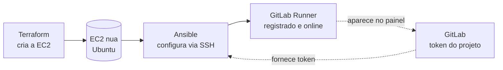

# 02.1 - Provisionando um GitLab Runner com Ansible

> **Segunda-feira, 10h.**
> Você é Platform Engineer na **Vortex Mobility**, a startup de micromobilidade que está escalando de 3 para 30 cidades. **Helena Marques**, Head de Engenharia de Plataforma, te chama:
>
> > *— "A gente vai automatizar os deploys da Vortex, mas o GitLab compartilhado não serve: precisamos de um runner **nosso**, que rode dentro da nossa conta AWS e tenha acesso às nossas credenciais. O problema é que configurar esse servidor na mão — instalar pacote, registrar o runner, ajustar o serviço — é um documento de 30 passos que ninguém lembra. Quero subir um runner novo rodando **um playbook**, não seguindo um wiki."*
>
> Você já sabe que o Terraform cria a máquina. Agora precisa **ver o Ansible configurar essa máquina** do zero até virar um runner registrado. **Diego**, o SRE sênior, passa na sua mesa: *— "Faz uma vez no braço pra entender cada peça. Depois é só rodar o playbook."*

Esse laboratório é o que vamos fazer juntos durante a aula: provisionar uma EC2 com Terraform, conectar essa máquina ao Ansible e rodar um playbook que a transforma num **GitLab Runner registrado** e dedicado a um projeto. No final, você terá feito tudo o que Helena precisava para parar de configurar servidor na mão.

> Os comandos deste lab rodam em **dois lugares**: o **terminal do Codespaces** (onde estão Terraform, Ansible e a chave SSH) e o **console web do GitLab** (onde você cria o projeto e gera o token). Cada passo indica onde executar.

> [!WARNING]
> **Pré-requisitos obrigatórios antes de começar:**
>
> - [ ] **Módulo 01 (Terraform) concluído** — você entende `init/plan/apply` e state remoto no S3
> - [ ] Bucket de state remoto existe no S3 (`base-config-<SEU-RM>`, criado no [setup inicial](../../00-create-codespaces/README.md))
> - [ ] Credenciais AWS do Academy atualizadas no Codespaces
> - [ ] Conta no [GitLab](https://gitlab.com/) (gratuita)
>
> **Valide rapidamente:**
>
> ```bash
> aws sts get-caller-identity
> ```
>
> Se retornar o JSON com seu `Account` e `Arn`, você está pronto.

## O que você vai fazer

Tempo estimado: **60–90 min** (execução pura ~25 min — o `terraform apply` provisiona a EC2 e roda o bootstrap, e o `ansible-playbook` leva alguns minutos — mais o tempo para você ler, copiar comandos, observar resultados nos prints e entender cada peça).

Vamos separar com clareza **quem faz o quê**: o **Terraform** cria a EC2 e prepara o sistema operacional mínimo; o **Ansible** entra depois e configura essa EC2 de forma declarativa até ela virar um GitLab Runner registrado. Esse é o padrão clássico de IaC + config management que você vai usar pelo resto da carreira.

## Principais pontos de aprendizagem

- instalar e usar Ansible a partir de um ambiente isolado (virtualenv)
- gerar e registrar uma chave SSH para autenticar no GitLab
- criar um projeto no GitLab e gerar um token de registro de runner
- provisionar a EC2 do runner com Terraform usando state remoto no S3
- conectar o Ansible ao host criado via inventário (`hosts`)
- rodar um playbook que instala, configura e **registra** o GitLab Runner
- destruir a infraestrutura ao final para não deixar custo ligado

## O que você terá ao final

Ao final deste laboratório, você terá uma EC2 rodando como **GitLab Runner registrado** e visível no painel do seu projeto GitLab, configurada inteiramente por um playbook Ansible. **Helena vai querer ver o runner aparecendo "online" no painel de CI/CD do projeto** — esse é o entregável simbólico do lab.

> [!TIP]
> Sempre que encontrar um bloco com o título **💡 Clique para entender**, abra esse trecho. Ele traz a anatomia do comando, o contexto prático e links oficiais para aprofundamento.

## Mapa do lab

| Parte | O que você faz | Passos | Tempo |
|-------|----------------|--------|-------|
| [Parte 1](#parte-1---preparando-o-ambiente) | Atualizar o repositório e entrar na pasta | [1](#passo-1) · [2](#passo-2) | ~3 min |
| [Parte 2](#parte-2---instalando-ansible-python-e-virtualenv) | Instalar Python, Ansible e virtualenv | [3](#passo-3) (3.1·3.2·3.3·3.4·3.5) | ~10 min |
| [Parte 3](#parte-3---configurando-o-acesso-ao-gitlab) | Conta GitLab e chave SSH | [4](#passo-4) · [5](#passo-5) (5.1–5.6) | ~10 min |
| [Parte 4](#parte-4---criando-o-primeiro-projeto-no-gitlab) | Criar o projeto e subir o código | [6](#passo-6) · [7](#passo-7) · [8](#passo-8) · [9](#passo-9) (9.1–9.6) | ~10 min |
| [Parte 5](#parte-5---gerando-o-token-do-runner) | Gerar o token e colá-lo no playbook | [10](#passo-10) · [11](#passo-11) · [12](#passo-12) · [13](#passo-13) · [14](#passo-14) · [15](#passo-15) · [16](#passo-16) | ~10 min |
| [Parte 6](#parte-6---provisionando-a-ec2-do-runner-com-terraform) | Provisionar a EC2 com Terraform | [17](#passo-17) · [18](#passo-18) · [19](#passo-19) · [20](#passo-20) · [21](#passo-21) · [22](#passo-22) | ~15 min |
| [Parte 7](#parte-7---configurando-a-ec2-como-runner-com-ansible) | Rodar o playbook Ansible | [23](#passo-23) · [24](#passo-24) · [25](#passo-25) · [26](#passo-26) | ~10 min |
| [Parte 8](#parte-8---destruindo-a-infraestrutura) | Destruir a infra ao final | [27](#passo-27) | ~3 min |

> [!TIP]
> Se travou em algum passo, você pode pular direto: clique no número do passo na coluna **Passos** acima.

<details>
<summary><b>💡 O que é um GitLab Runner (e por que Ansible) em 3 parágrafos</b></summary>
<blockquote>

Um **GitLab Runner** é o processo que efetivamente **executa** os jobs de um pipeline de CI/CD. Quando você dá um push e o pipeline roda `terraform plan`, é o runner que pega esse job, executa os comandos numa máquina e devolve o resultado para o GitLab. Você pode usar os runners compartilhados do GitLab, mas empresas que rodam infraestrutura preferem um runner **próprio**, dentro da própria conta de nuvem, com acesso às próprias credenciais — é o caso da Vortex.

O runner é só um programa, mas para funcionar ele precisa de um servidor configurado: o pacote `gitlab-runner` instalado, o Terraform disponível (porque os jobs vão rodar Terraform), um serviço `systemd` ativo e o runner **registrado** no projeto via um token. Fazer isso na mão é o "documento de 30 passos" que a Helena reclamou.

É aí que entra o **Ansible**: em vez de um humano seguir um wiki, descrevemos o estado desejado da máquina em arquivos YAML (os *playbooks* e *tasks*) e o Ansible aplica esse estado via SSH, de forma **idempotente** — rodar de novo não duplica nada. O Terraform cria a máquina; o Ansible a configura. Essa separação "provisionar vs. configurar" é um dos padrões mais importantes de plataforma.

Documentação oficial:
- [GitLab Runner](https://docs.gitlab.com/runner/)
- [Ansible — Getting Started](https://docs.ansible.com/ansible/latest/getting_started/index.html)

</blockquote>
</details>

## Contexto

A Vortex está montando seu pipeline de entrega contínua. O passo de hoje é ter um runner **dedicado**, dentro da conta AWS da empresa, capaz de rodar Terraform com as credenciais certas. Em vez de configurar esse servidor manualmente toda vez que precisar de um runner novo, vamos codificar a configuração com Ansible — um playbook que qualquer pessoa do time roda e obtém exatamente o mesmo runner. Esse runner é a peça que o módulo 03 (CI/CD) vai usar para automatizar `plan`/`apply`.



---

## Parte 1 - Preparando o ambiente

### Resultado esperado desta parte

Ao final desta etapa, você estará com o repositório atualizado e dentro da pasta do laboratório, no terminal do Codespaces.

---

<a id="passo-1"></a>

**1.** No **terminal do Codespaces**, entre na pasta principal do repositório e garanta que está com a versão mais atualizada do exercício:

```bash
cd /workspaces/FIAP-Platform-Engineering/
git reset --hard && git pull origin master
```

> [!IMPORTANT]
> O `git reset --hard` descarta alterações locais não commitadas. Se você tiver trabalho em andamento que queira manter, faça commit antes.

---

<a id="passo-2"></a>

**2.** Entre na pasta do laboratório:

```bash
cd /workspaces/FIAP-Platform-Engineering/02-Ansible/01-provisionando-gitlab-runner/
```

### Checkpoint

- o repositório está atualizado
- você está dentro de `02-Ansible/01-provisionando-gitlab-runner/`

---

## Parte 2 - Instalando Ansible, Python e virtualenv

### Resultado esperado desta parte

Ao final desta etapa, você terá Python atualizado, Ansible instalado e um virtualenv ativo no terminal do Codespaces.

Esta parte é um único bloco grande no roteiro antigo. Vamos quebrá-la em sub-passos, cada um com uma validação rápida, para que — se algo falhar — você saiba exatamente onde travou.

---

<a id="passo-3"></a>

**3.** Vamos instalar e preparar o ambiente do Ansible. Execute os sub-passos abaixo **na ordem**, no terminal do Codespaces.

**3.1.** Atualize o sistema e instale o Python 3.8:

```bash
sudo apt update -y
sudo apt install software-properties-common -y
sudo add-apt-repository ppa:deadsnakes/ppa -y
sudo apt install python3.8 -y
sudo update-alternatives --install /usr/bin/python python /usr/bin/python3.8 1
```

Confirme que o Python responde:

```bash
python --version
```

Deve imprimir algo como `Python 3.8.x`.

<details>
<summary><b>⚠ Se der erro: <code>add-apt-repository: command not found</code></b></summary>
<blockquote>

O pacote `software-properties-common` não terminou de instalar. Rode novamente:

```bash
sudo apt update -y && sudo apt install software-properties-common -y
```

Depois repita o `add-apt-repository ppa:deadsnakes/ppa -y`.

</blockquote>
</details>

**3.2.** Instale o Ansible:

```bash
sudo add-apt-repository --yes --update ppa:ansible/ansible -y
sudo apt install ansible -y
```

Confirme a versão:

```bash
ansible --version
```

Deve imprimir a versão do Ansible e o caminho do executável.

**3.3.** Instale o `pip3`:

```bash
sudo apt-get install python3-pip -y
```

Confirme:

```bash
pip3 --version
```

**3.4.** Instale o `virtualenv` e crie um ambiente isolado:

```bash
sudo pip3 install virtualenv
python3 -m venv ~/venv
```

**3.5.** Ative o virtualenv:

```bash
source ~/venv/bin/activate
```

O prompt do terminal deve passar a exibir o prefixo `(venv)`. Esse prefixo confirma que o ambiente está ativo.

<details>
<summary><b>💡 Clique para entender: por que virtualenv</b></summary>
<blockquote>

Um **virtualenv** é um diretório isolado com sua própria cópia do Python e dos pacotes. Em vez de instalar dependências "globalmente" no sistema (onde elas podem conflitar com outras ferramentas), você as mantém presas a um ambiente que pode ser ativado e desativado.

O prefixo `(venv)` no prompt é o sinal de que tudo o que você instalar com `pip` daqui em diante fica dentro desse ambiente. Se você abrir um novo terminal, precisa rodar `source ~/venv/bin/activate` de novo — o ambiente não se ativa sozinho.

Em projetos de plataforma e dados, isolar dependências por projeto é prática padrão: evita o clássico "funciona na minha máquina" causado por versões de pacote divergentes.

Documentação oficial:
- [venv — Python](https://docs.python.org/3/library/venv.html)

</blockquote>
</details>

### Checkpoint

- `python --version` responde 3.8.x
- `ansible --version` responde sem erro
- o prompt mostra `(venv)`

---

## Parte 3 - Configurando o acesso ao GitLab

### Resultado esperado desta parte

Ao final desta etapa, você terá uma conta GitLab e uma chave SSH registrada e ativa na sessão, capaz de autenticar seus `git push`.

---

<a id="passo-4"></a>

**4.** Antes de criar o runner, você precisa de uma conta no GitLab. Acesse o [GitLab](https://gitlab.com/) e crie uma conta — ou, se já tiver, apenas faça login.

---

<a id="passo-5"></a>

**5.** Para fazer `git push` para o GitLab via SSH, você vai criar e registrar uma chave de conexão. Siga os sub-passos abaixo.

**5.1.** No **terminal do Codespaces**, crie a chave SSH:

```bash
ssh-keygen -t rsa -b 2048 -C "gitlab key" -f /home/vscode/.ssh/gitlab
```

**5.2.** Pressione **Enter duas vezes** para indicar que não quer senha para a chave.


**5.3.** Abra a parte **pública** da chave no editor do Codespaces e copie todo o conteúdo para a área de transferência do seu computador:

```bash
code /home/vscode/.ssh/gitlab.pub
```

**5.4.** Acesse a página de chaves SSH do seu GitLab: [Chaves SSH do GitLab](https://gitlab.com/-/user_settings/ssh_keys).

**5.5.** Cole o conteúdo copiado no campo destacado e clique em **Add New Key**.


**5.6.** De volta ao **terminal do Codespaces**, ative a chave na sessão atual do terminal:

```bash
eval $(ssh-agent -s)
ssh-add -k /home/vscode/.ssh/gitlab
```

<details>
<summary><b>⚠ Se der erro: <code>Could not open a connection to your authentication agent</code> no ssh-add</b></summary>
<blockquote>

O `ssh-agent` não está rodando na sessão atual. Rode o `eval` antes do `ssh-add`, na mesma linha de raciocínio:

```bash
eval $(ssh-agent -s)
ssh-add -k /home/vscode/.ssh/gitlab
```

Lembre que o agent vive **por sessão de terminal**: se você abrir um novo terminal, precisa rodar o `eval` + `ssh-add` de novo.

</blockquote>
</details>

### Checkpoint

- a chave `gitlab` existe em `/home/vscode/.ssh/`
- a chave pública foi adicionada ao seu GitLab
- `ssh-add` confirmou a identidade adicionada

---

## Parte 4 - Criando o primeiro projeto no GitLab

### Resultado esperado desta parte

Ao final desta etapa, você terá um projeto `primeiro-projeto` no GitLab com o código de exemplo já versionado.

---

<a id="passo-6"></a>

**6.** No **console web do GitLab**, crie um novo projeto. Acesse [Novo projeto](https://gitlab.com/projects/new) e clique em **Create blank project**.

---

<a id="passo-7"></a>

**7.** Dê o nome de `primeiro-projeto`, marque como **Public** e **desmarque** a opção de inicializar com README.


---

<a id="passo-8"></a>

**8.** Clique em **Create project**.

---

<a id="passo-9"></a>

**9.** De volta ao **terminal do Codespaces**, você vai subir o código de exemplo para esse projeto. Siga os sub-passos, cuidando dos pontos onde precisa colocar suas informações.

**9.1.** Configure seu nome e e-mail do GitLab no git:

```bash
git config --global user.name "SEU NOME"
git config --global user.email "SEU EMAIL DO GITLAB"
```

**9.2.** Copie o código do projeto para outra pasta, para poder inicializar um repositório git separado:

```bash
cp -frv /workspaces/FIAP-Platform-Engineering/02-Ansible/01-provisionando-gitlab-runner/primeiro-projeto/ ~/environment/
```

**9.3.** Entre na pasta copiada:

```bash
cd /home/vscode/environment/primeiro-projeto
```

**9.4.** Inicialize o repositório e aponte para o seu projeto no GitLab (troque `SEU-USUARIO`):

```bash
git init
git remote add origin git@gitlab.com:SEU-USUARIO/primeiro-projeto.git
```

**9.5.** Adicione e faça o commit inicial:

```bash
git add .
git commit -m "Initial commit"
git branch -M master
```

**9.6.** Faça o push para o GitLab:

```bash
git push -uf origin master
```


<details>
<summary><b>⚠ Se der erro: <code>Permission denied (publickey)</code> no git push</b></summary>
<blockquote>

A chave SSH não está ativa na sessão ou não foi adicionada ao GitLab. Verifique:

1. Você rodou o `eval $(ssh-agent -s)` e `ssh-add` do passo 5.6 **neste mesmo terminal**?
2. A chave pública foi colada no GitLab (passo 5.5)?

Teste a conexão:

```bash
ssh -T git@gitlab.com
```

Deve responder com uma saudação contendo seu usuário. Se não, repita os sub-passos 5.5 e 5.6.

</blockquote>
</details>

### Checkpoint

- o projeto `primeiro-projeto` no GitLab mostra os arquivos do código
- o `git push` terminou sem erro de autenticação

---

## Parte 5 - Gerando o token do runner

### Resultado esperado desta parte

Ao final desta etapa, você terá um token de registro de runner gerado no GitLab e colado no playbook Ansible.

---

<a id="passo-10"></a>

**10.** No seu projeto do GitLab, clique em **Settings** na lateral esquerda e depois em **CI/CD**.


---

<a id="passo-11"></a>

**11.** Em **Runners**, clique para expandir.


---

<a id="passo-12"></a>

**12.** Na aba **Instance**, desabilite a opção **Turn on instance runners for this project** — assim, o runner que vamos criar será usado apenas por este projeto.


---

<a id="passo-13"></a>

**13.** Clique em **Assigned project runners** e em seguida em **Create project runner**, para gerar o token que registrará o runner.


---

<a id="passo-14"></a>

**14.** No campo de **Tags**, adicione o valor `shell, terraform` e clique em **Create runner**.


---

<a id="passo-15"></a>

**15.** Copie o token gerado para a área de transferência do seu computador.


---

<a id="passo-16"></a>

**16.** De volta ao **Codespaces**, cole o token do GitLab no arquivo Ansible que registra o runner. Abra o arquivo e altere a **linha 48**, substituindo o placeholder `SEU TOKEN VAI AQUI` pelo token que você copiou. Não esqueça de salvar.

```bash
code /workspaces/FIAP-Platform-Engineering/02-Ansible/01-provisionando-gitlab-runner/ansible-gitlab-runner/tasks/register-runner.yml
```

A linha 48 deve ficar assim (com o seu token real no lugar do placeholder):

```yaml
    --registration-token 'COLE-SEU-TOKEN-AQUI'
```

> [!IMPORTANT]
> O token é sensível: trate como senha. Em ambientes reais, ele viria de um cofre de segredos (ex: Ansible Vault, AWS Secrets Manager), nunca hardcoded no arquivo. Para o lab, colamos direto por simplicidade.

### Checkpoint

- o token foi gerado no GitLab
- a linha 48 de `register-runner.yml` contém o seu token e o arquivo foi salvo

---

## Parte 6 - Provisionando a EC2 do runner com Terraform

### Resultado esperado desta parte

Ao final desta etapa, você terá uma EC2 provisionada e com o IP público em mãos para o Ansible.

---

<a id="passo-17"></a>

**17.** O runner será uma EC2 provisionada com Terraform. Entre na pasta com o código:

```bash
cd /workspaces/FIAP-Platform-Engineering/02-Ansible/01-provisionando-gitlab-runner/terraform-gitlab-runner/
```

---

<a id="passo-18"></a>

**18.** O state remoto deste projeto usa um bucket S3. Abra o arquivo `state.tf` e troque o placeholder `base-config-<SEU-RM>` pelo nome do **seu** bucket de state (o mesmo criado no setup inicial do módulo 01):

```bash
code state.tf
```

O bloco deve ficar parecido com isto, com o seu RM no lugar:

```hcl
terraform {
  backend "s3" {
    bucket = "base-config-12345"
    key    = "gitlab-runner-fleet"
    region = "us-east-1"
  }
}
```

> [!CAUTION]
> Nome de bucket S3 **não pode conter espaços nem letras maiúsculas**. Use apenas minúsculas, números e hífens (ex: `base-config-12345`).

---

<a id="passo-19"></a>

**19.** Inicialize o Terraform (vamos usar a flag `-auto-approve` nos próximos comandos para evitar a confirmação manual):

```bash
terraform init
```

<details>
<summary><b>⚠ Se der erro: <code>NoSuchBucket</code> ou <code>error configuring S3 Backend</code></b></summary>
<blockquote>

O bucket informado em `state.tf` não existe ou o nome está errado (espaços, maiúsculas, RM incorreto). Liste seus buckets para confirmar o nome exato:

```bash
aws s3 ls | grep base-config
```

Corrija o `state.tf` com o nome listado e rode `terraform init` novamente.

</blockquote>
</details>

---

<a id="passo-20"></a>

**20.** Veja o que será criado:

```bash
terraform plan
```

---

<a id="passo-21"></a>

**21.** Provisione a máquina que será o runner. Esse apply, além de criar a EC2, roda um script de bootstrap (`install-python.sh`) na máquina para preparar tudo o que o Ansible vai precisar:

```bash
terraform apply -auto-approve
```

<details>
<summary><b>💡 Clique para entender: por que Terraform e Ansible juntos</b></summary>
<blockquote>

Repare na divisão de responsabilidades: o Terraform **cria** a EC2 (recurso de infraestrutura) e ainda roda um `install-python.sh` mínimo via *provisioner* só para garantir que o Python existe — porque o Ansible precisa de Python no host de destino para funcionar.

A configuração de verdade (instalar `gitlab-runner`, Terraform, ajustar o `systemd`, registrar o runner) fica para o **Ansible**, na próxima parte. Poderíamos fazer tudo no Terraform via provisioners, mas isso é considerado anti-padrão: provisioners são frágeis e não idempotentes. Ansible foi feito exatamente para configuração de servidor.

A AMI é resolvida dinamicamente por um `data "aws_ami"` (Ubuntu 22.04 mais recente da Canonical) em vez de um ID fixo — assim o lab não quebra quando a AMI antiga é despublicada.

Documentação oficial:
- [Terraform provisioners (e por que evitar)](https://developer.hashicorp.com/terraform/language/resources/provisioners/syntax)
- [data source aws_ami](https://registry.terraform.io/providers/hashicorp/aws/latest/docs/data-sources/ami)

</blockquote>
</details>

---

<a id="passo-22"></a>

**22.** Copie o IP público da instância — vamos usá-lo no inventário do Ansible:

```bash
terraform output ec2_dns
```


### Checkpoint

- o `terraform apply` terminou com `Apply complete!`
- `terraform output ec2_dns` mostra o IP público da EC2

---

## Parte 7 - Configurando a EC2 como runner com Ansible

### Resultado esperado desta parte

Ao final desta etapa, a EC2 estará configurada como GitLab Runner registrado e aparecerá online no painel do projeto.

---

<a id="passo-23"></a>

**23.** Entre na pasta onde o Ansible será executado:

```bash
cd /workspaces/FIAP-Platform-Engineering/02-Ansible/01-provisionando-gitlab-runner/ansible-gitlab-runner/
```

---

<a id="passo-24"></a>

**24.** Abra o arquivo de **inventário** (`hosts`), onde configuramos quais máquinas o Ansible acessa e como. Substitua `<IP DO SERVER>` pelo IP público da EC2 (passo 22):

```bash
code hosts
```


<details>
<summary><b>💡 Clique para entender: o inventário do Ansible</b></summary>
<blockquote>

O arquivo `hosts` é o **inventário**: ele diz ao Ansible quais máquinas existem e como conectar a elas. No nosso caso:

- `[runner]` é um **grupo** de hosts; abaixo dele listamos a EC2 com seu `ansible_host` (o IP público).
- `[all:vars]` define variáveis válidas para todos os hosts — aqui, a chave SSH privada (`ansible_ssh_private_key_file`) que o Ansible usa para entrar na máquina e a elevação de privilégio (`ansible_become`).

É o equivalente Ansible do "para quais servidores eu aplico essa configuração e com qual credencial". Em ambientes maiores, o inventário pode ser dinâmico (gerado a partir de tags da AWS, por exemplo).

Documentação oficial:
- [Ansible — Inventário](https://docs.ansible.com/ansible/latest/inventory_guide/intro_inventory.html)

</blockquote>
</details>

---

<a id="passo-25"></a>

**25.** Execute o playbook que configura a EC2 como GitLab Runner:

```bash
ANSIBLE_HOST_KEY_CHECKING=False ansible-playbook -u 'ubuntu' -i hosts --extra-vars 'gitlab_runner_name=gitlab-runner-fleet-001' play.yaml
```


<details>
<summary><b>💡 Clique para entender: ANSIBLE_HOST_KEY_CHECKING=False</b></summary>
<blockquote>

Quando você conecta via SSH a um host novo pela primeira vez, o SSH pergunta se você confia na *fingerprint* daquela máquina (`Are you sure you want to continue connecting?`). Numa execução automatizada, essa pergunta travaria o playbook esperando um "yes".

`ANSIBLE_HOST_KEY_CHECKING=False` desliga essa verificação **só para esta execução**, permitindo que o Ansible conecte sem prompt interativo. É aceitável num lab efêmero; em produção, prefira gerenciar `known_hosts` adequadamente.

Os outros parâmetros: `-u ubuntu` é o usuário SSH, `-i hosts` aponta o inventário, e `--extra-vars` passa o nome do runner para o playbook.

Documentação oficial:
- [Ansible — Host key checking](https://docs.ansible.com/ansible/latest/reference_appendices/config.html#host-key-checking)

</blockquote>
</details>

<details>
<summary><b>⚠ Se der erro: <code>UNREACHABLE</code> / <code>Failed to connect to the host via ssh</code></b></summary>
<blockquote>

O Ansible não conseguiu chegar na EC2. Verifique, na ordem:

1. O **IP no `hosts`** é exatamente o que `terraform output ec2_dns` retornou (passo 22)?
2. A EC2 terminou de inicializar? Logo após o `apply`, o SSH pode levar ~1 min para aceitar conexões. Aguarde e rode o playbook de novo.
3. A chave `ansible_ssh_private_key_file` (`/home/vscode/.ssh/vockey.pem`) existe? Confira com `ls -la /home/vscode/.ssh/vockey.pem`.
4. O Security Group libera a porta 22 (ele libera, por padrão, em `securitygroup.tf`).

</blockquote>
</details>

---

<a id="passo-26"></a>

**26.** Volte à mesma página do GitLab onde você pegou o token (Settings → CI/CD → Runners). Agora há um runner **registrado** e online para o projeto.


<details>
<summary><b>⚠ Se der erro: o playbook termina sem falha, mas o runner não aparece registrado no GitLab</b></summary>
<blockquote>

Quase sempre é o **token**. Verifique:

1. A **linha 48** de `register-runner.yml` tem o token real, não o placeholder `SEU TOKEN VAI AQUI` (passo 16)?
2. O token foi gerado para **este** projeto (passo 13-15)? Tokens de runner são por projeto.
3. Rode o playbook de novo (passo 25) — o registro é idempotente. Se o token estava errado, corrija a linha 48 e re-execute.

</blockquote>
</details>

### Checkpoint

- o playbook terminou com `failed=0`
- o runner aparece registrado e online no painel CI/CD do projeto GitLab

---

## Parte 8 - Destruindo a infraestrutura

### Resultado esperado desta parte

Ao final desta etapa, a EC2 do runner será destruída, zerando o custo.

---

<a id="passo-27"></a>

**27.** A EC2 do runner é infraestrutura **paga e ligada**. Assim que terminar de validar o runner, destrua tudo. Volte para a pasta do Terraform e rode o destroy:

```bash
cd /workspaces/FIAP-Platform-Engineering/02-Ansible/01-provisionando-gitlab-runner/terraform-gitlab-runner/
terraform destroy -auto-approve
```

> [!CAUTION]
> **Destroy é obrigatório, não opcional.** A EC2 `t2.micro` custa ~$0,0116/h. Esquecê-la ligada por uma semana consome ~$2 do orçamento do Learner Lab — pouco, mas evitável. Diferente de "pausar", o `destroy` **zera** o custo e remove o recurso de verdade. O state remoto no S3 permanece e custa centavos.

### Checkpoint

- o `terraform destroy` terminou com `Destroy complete!`
- a EC2 não aparece mais no console do EC2

---

## Conclusão

Se você chegou até aqui, então já executou:

- instalação de Python, Ansible e virtualenv num ambiente isolado
- geração de chave SSH e registro no GitLab
- criação de projeto no GitLab e push do código via SSH
- geração do token de registro do runner
- provisionamento da EC2 com Terraform usando state remoto no S3
- configuração da EC2 como GitLab Runner via playbook Ansible
- destruição da infraestrutura ao final

**Mensagem para Helena**: o runner da Vortex agora sobe por código. O "documento de 30 passos" virou um `terraform apply` seguido de um `ansible-playbook` — qualquer pessoa do time sobe um runner idêntico, e o Ansible garante que rodar de novo não quebra nada. Está pronto para automatizar os deploys no módulo de CI/CD.

Este laboratório forma a base para o próximo módulo: com o runner registrado, o GitLab pode executar pipelines automatizados.

---

## Próximo passo

Abra o próximo módulo: **[03 — CI/CD com GitLab](../../03-CICD/README.md)**.

Lá Diego volta com uma demanda: *"Temos o runner. Agora quero que todo push na master rode `plan` e `apply` sozinho, com um gate de segurança que barre configuração insegura antes de chegar na nuvem."*

---

<details>
<summary><b>💡 Glossário rápido — termos que aparecem neste lab</b></summary>
<blockquote>

| Termo | O que é |
|-------|---------|
| **Ansible** | Ferramenta de configuração de servidores. Descreve o estado desejado em YAML (playbooks/tasks) e aplica via SSH, de forma idempotente. |
| **Playbook** | Arquivo YAML que orquestra uma sequência de tasks Ansible contra um conjunto de hosts. Aqui é o `play.yaml`. |
| **Task** | Unidade de trabalho do Ansible (instalar pacote, copiar arquivo, rodar comando). As tasks deste lab estão em `tasks/`. |
| **Inventário (`hosts`)** | Arquivo que lista quais máquinas o Ansible gerencia e como conectar (IP, usuário, chave SSH). |
| **Idempotência** | Propriedade de rodar a mesma operação várias vezes sem efeitos colaterais. Aplicar o playbook duas vezes não duplica nada. |
| **GitLab Runner** | Processo que executa os jobs de um pipeline de CI/CD. Aqui, dedicado a um único projeto. |
| **Token de registro** | Segredo gerado pelo GitLab que autentica e vincula um runner a um projeto. |
| **virtualenv** | Ambiente Python isolado, com pacotes próprios, ativado por `source ~/venv/bin/activate`. |
| **State remoto (S3)** | Arquivo de estado do Terraform guardado num bucket S3, para colaboração sem corromper o estado local. |
| **Provisioner (Terraform)** | Mecanismo que roda scripts no recurso recém-criado. Usado aqui só para o bootstrap mínimo de Python; configuração de verdade fica no Ansible. |

</blockquote>
</details>

<details>
<summary><b>💡 Como pedir ajuda se travou</b></summary>
<blockquote>

Antes de abrir issue/perguntar, colete estas 4 informações — elas reduzem o tempo de resposta em 10×:

1. **Em que passo você está** (ex: "passo 25, rodando o `ansible-playbook`")
2. **Mensagem de erro literal** (copia-cola completo do terminal, não screenshot — texto é pesquisável)
3. **Saída de** `terraform output ec2_dns` **e do arquivo** `hosts` (mostra o IP que o Ansible está usando)
4. **O que você já tentou**

Canais (em ordem de prioridade):

- **Issues do repositório**: [github.com/vamperst/FIAP-Platform-Engineering/issues](https://github.com/vamperst/FIAP-Platform-Engineering/issues)
- **E-mail do professor**: `Rafael@rfbarbosa.com`
- **LinkedIn**: [rafael-barbosa-serverless](https://www.linkedin.com/in/rafael-barbosa-serverless/)
- **Antes de tudo**: confira se o IP em `hosts` bate com o `terraform output ec2_dns` (~70% dos `UNREACHABLE` são IP desatualizado após um novo `apply`).

</blockquote>
</details>
